# 🖥️ MultiWindow Terminal

[](https://github.com/Dongran-wzr/multi-window-tools/actions/workflows/build.yml)

AI Coding 提效工具 —— 基于命令行的多窗口终端模拟器，单窗口最多支持 **9 个终端并行工作**。

## ✨ 功能特性

### 多任务终端并行
<p align="center">
  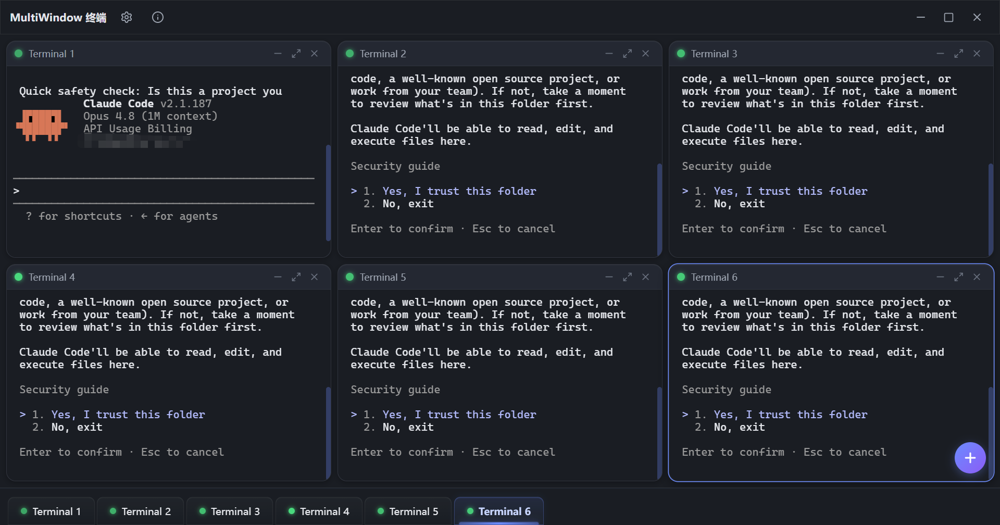
  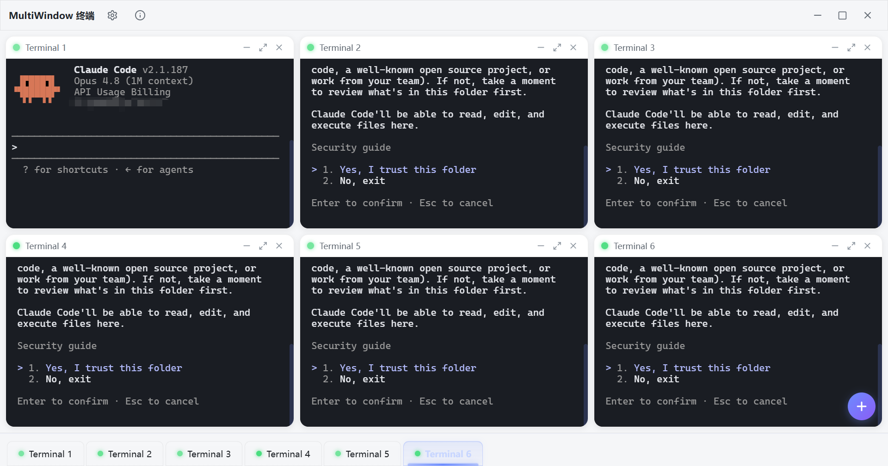
</p>

### 自定义路径
<p align="center">
  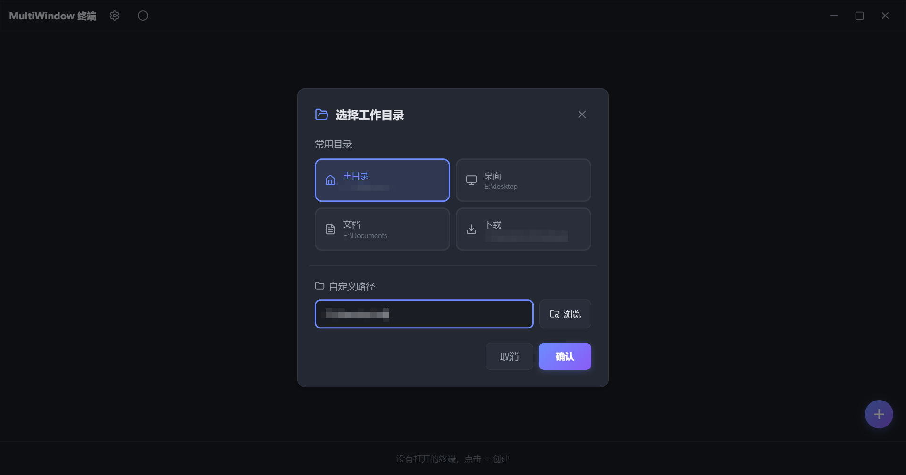
</p>

### 自由拖拽
<p align="center">
  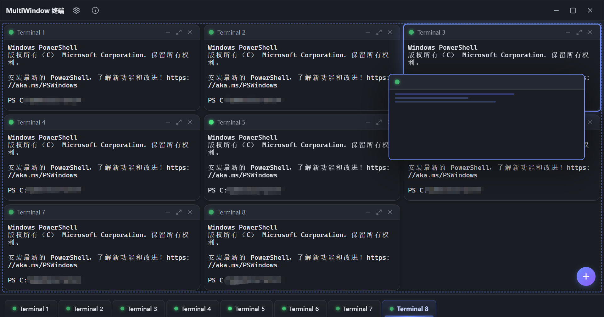
</p>

### 可变窗口
  <p align="center">
    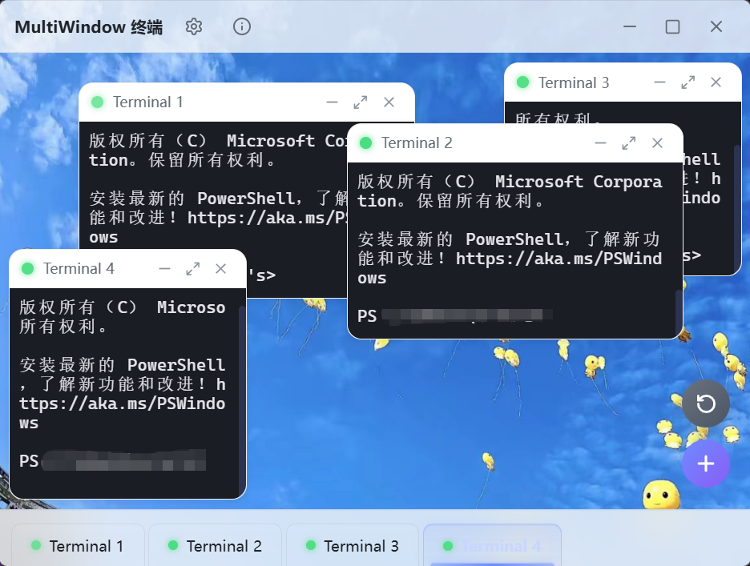
  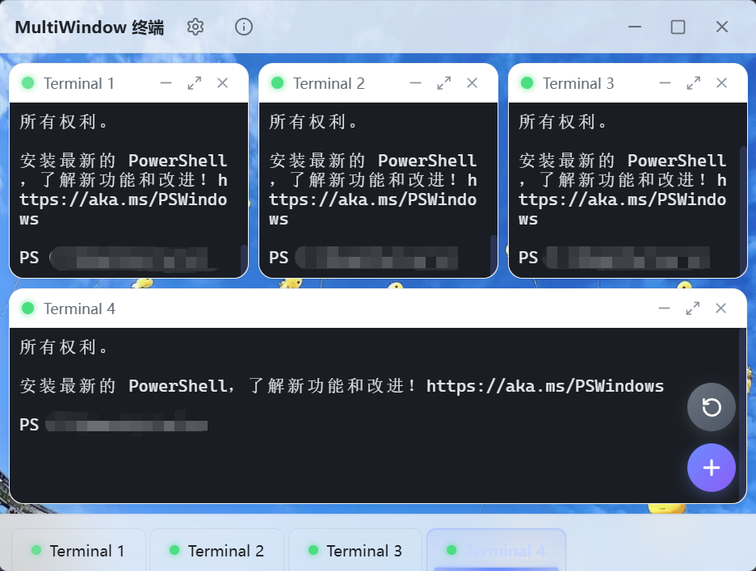
  </p>

### 高度自定义化
  <p align="center">
    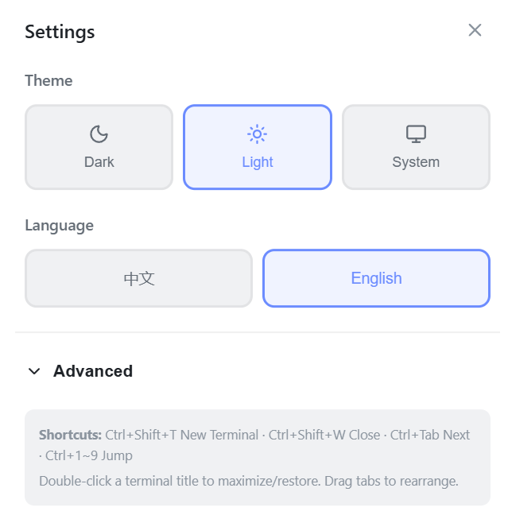
  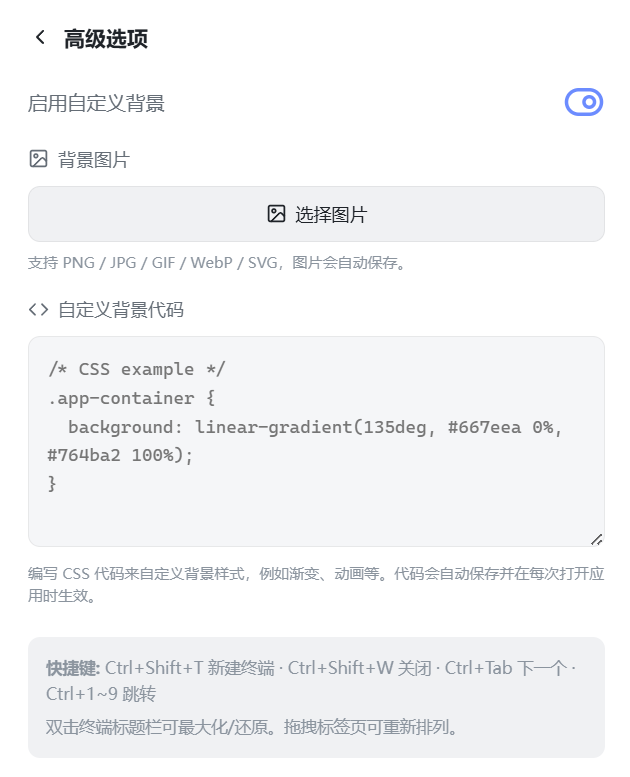
  </p>


## ⌨️ 快捷键

| 快捷键 | 功能 |
|--------|------|
| `Ctrl + Shift + T` | 新建终端 |
| `Ctrl + Shift + W` | 关闭当前终端 |
| `Ctrl + Tab` | 切换到下一个终端 |
| `Ctrl + Shift + Tab` | 切换到上一个终端 |
| `Ctrl + 1` ~ `Ctrl + 9` | 跳转到对应网格位置的终端 |

## 📥 下载安装

前往 [Releases](https://github.com/Dongran-wzr/multi-window-tools/releases) 页面，下载对应系统的安装包：

| 系统 | 安装包格式 |
|------|-----------|
| **Windows** | `.msi` / `.exe` |
| **macOS** | `.dmg` |
| **Linux** | `.deb` / `.AppImage` |

> Windows 用户也可以下载 `.exe` 便携版，无需安装直接运行。

### 安装与使用（以Windows为例）

<p align="center">
  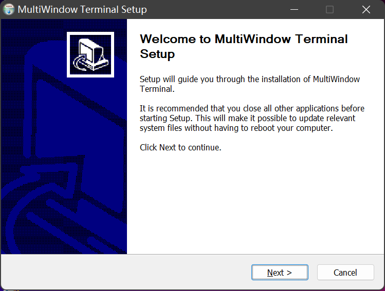
  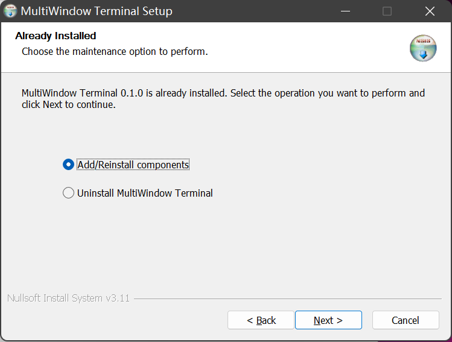
  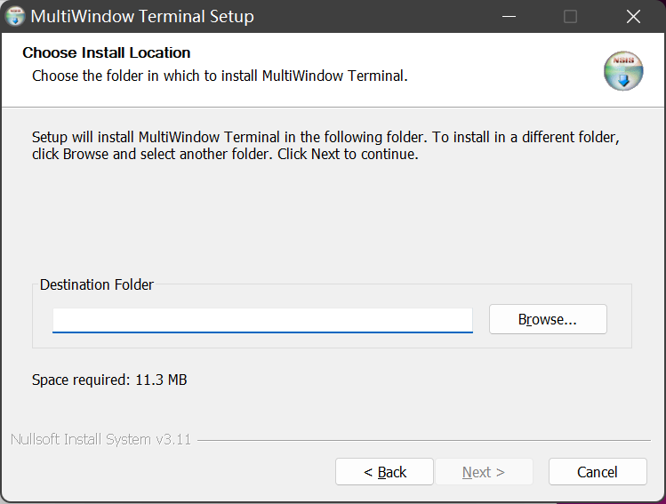
</p>

<p align="center">
  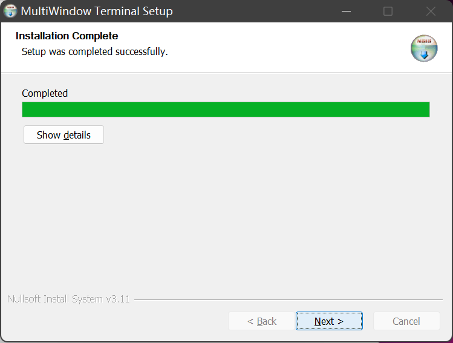
  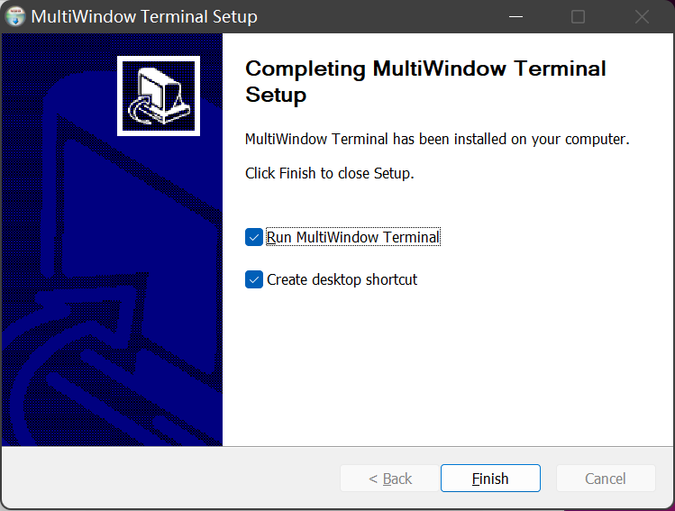
</p>

---

## 🚀 开发指南

### 环境要求

- [Node.js](https://nodejs.org/) ≥ 18
- [Rust](https://www.rust-lang.org/) 工具链 (rustc + cargo)
- 平台依赖：
  - **Windows**: [Microsoft WebView2](https://developer.microsoft.com/en-us/microsoft-edge/webview2/)（Windows 10 默认已安装）
  - **macOS**: Xcode Command Line Tools
  - **Linux**: `libwebkit2gtk-4.1-dev`、`libgtk-3-dev` 等（详见 [Tauri 文档](https://v2.tauri.app/start/prerequisites/)）

### 安装与运行

```bash
# 克隆仓库
git clone https://github.com/Dongran-wzr/multi-window-tools.git
cd multi-window-tools

# 安装前端依赖
npm install

# 启动开发模式（同时启动 Vite 和 Tauri）
npm run tauri dev
```

### 构建生产版本

```bash
npm run tauri build
```

构建产物位于 `src-tauri/target/release/bundle/`。

### 更新版本号

打包前可通过以下命令统一更新 `package.json`、`Cargo.toml`、`tauri.conf.json` 三处的版本号：

```bash
npm run version:bump -- 1.2.0
```

版本号会在应用「关于」弹窗中显示。

## ⚙️ 配置说明

所有设置默认保存在系统配置目录下的 `multi-window-terminal/config.json` 中：

- **Windows**: `%APPDATA%/multi-window-terminal/`
- **macOS**: `~/Library/Application Support/multi-window-terminal/`
- **Linux**: `~/.config/multi-window-terminal/`

### 可配置项

| 配置项 | 说明 |
|--------|------|
| 主题 | 深色 / 浅色 / 跟随系统 |
| 语言 | 中文 / English |
| 终端布局 | 各终端在网格中的位置 |
| 背景图片 | 自定义背景图片（支持 PNG/JPG/GIF/WebP/SVG/BMP） |
| 背景 CSS | 自定义 CSS 背景代码（渐变色、动画等） |

## 📂 项目结构

```
multiWindow/
├── index.html                  # 入口 HTML
├── package.json                # 前端依赖与脚本
├── vite.config.ts              # Vite 构建配置
├── tsconfig.json               # TypeScript 配置
├── src/                        # 前端源码 (React + TypeScript)
│   ├── main.tsx                # 应用入口
│   ├── App.tsx                 # 根组件
│   ├── stores/
│   │   └── terminalStore.ts    # Zustand 状态管理
│   ├── hooks/
│   │   ├── useTerminal.ts      # 终端生命周期 Hook
│   │   └── useGridLayout.ts    # 网格布局计算 Hook
│   ├── components/
│   │   ├── TerminalGrid.tsx    # 3×3 网格容器
│   │   ├── TerminalWindow.tsx  # 单个终端窗口 (xterm.js)
│   │   ├── TitleBar.tsx        # 自定义标题栏
│   │   ├── TabBar.tsx          # 底部标签栏
│   │   ├── TabItem.tsx         # 标签项（支持右键菜单）
│   │   ├── AddButton.tsx       # 新建终端浮动按钮
│   │   ├── SettingsModal.tsx   # 设置弹窗
│   │   └── AboutModal.tsx      # 关于弹窗
│   ├── i18n/
│   │   └── translations.ts     # 中英文翻译字典
│   └── styles/
│       └── themes.css          # 主题 CSS 变量与全局样式
└── src-tauri/                  # Rust 后端源码
    ├── Cargo.toml              # Rust 依赖
    ├── tauri.conf.json         # Tauri 配置
    └── src/
        ├── main.rs             # Rust 入口
        ├── lib.rs              # Tauri IPC 命令处理
        ├── config/
        │   └── mod.rs          # 配置管理器
        ├── state/
        │   └── mod.rs          # 应用共享状态
        └── terminal/
            ├── mod.rs          # 终端模块
            ├── pty.rs          # PTY 进程封装
            └── manager.rs      # 终端生命周期管理
```

---

> 如果你觉得这个项目对提效有帮助，欢迎 ⭐ Star 支持！
